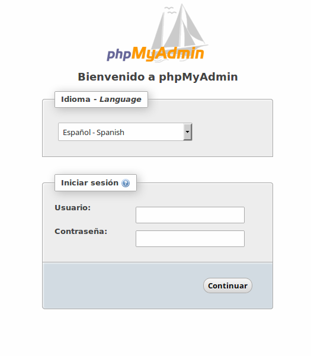

Una vez instalado el servidor web Apache se crea una estructura archivos y directorios, entre los que se destacan: 

| Directorio o archivo     | Descripción          |
| ---------------------- | --------------------------------------- |
| `/etc/apache2/apache.conf`     | Archivo de configuración general de Apache|
| `/etc/apache2/sites-available` | Directorio donde se alojan los archivos de configuración de los sitios  definidos pero aún no activos (es decir, no habilitados|
| `/etc/apache2/sites-enabled`     | Directorio donde se alojan los archivos de configuración de los sitios  activos o habilitados|
| `/var/www/html`| Directorio por del sitio web por defecto, donde Apache aloja las páginas web|
| `/home/usuario/public_html`| Directorio donde se aloja el sitio web personal de cada usuario del sistema|


Una vez finalizada la instalación, el servidor web Apache se iniciará automáticamente. Podemos verificarlo, ejecutando el siguiente comando: 

```bash
sudo systemctl status apache2
```

Podemos comprobar la configuración de Apache para verificar si existen errores en su configuración:

```bash
sudo apache2ctl configtest
```

Donde obtendremos un error similar a:
```bash
Set the 'ServerName' directive globally to suppress this message 
Syntax OK
```
Para corregir esto, abrimos el archivo de configuración principal de Apache con nuestro editor de texto:

```bash
sudo nano /etc/apache2/apache2.conf
```
Y agregamos al final del archivo la directiva `ServerName`, seguida del **nombre de dominio** o **dirección IP** de nuestro servidor web. Es decir: 

```apache
ServerName dominio_del_servidor_o_IP 
```
Guardamos y cerramos el archivo. Luego, para verificar que todo está bien (es decir, que no hay errores de sintaxis en el archivo de configuración de Apache):

```bash
sudo apache2ctl configtest
```
Y como definimos la directiva global `ServerName`, veremos la siguiente salida: 

```apache
Output
Syntax OK
```

Por último, reiniciamos Apache para implementar los cambios:
```bash
sudo systemctl restart apache2
```


##Inicio y parada del servidor

Existen diversos comandos para gestionar el servidor web Apache. 

**Detener el servidor**
```bash
sudo systemctl stop apache2
```

**Iniciar el servidor**
```bash
sudo systemctl start apache2
```

**Reiniciar el servidor**
```bash
sudo systemctl restart apache2
```

**Recargar la configuración del servidor (sin reiniciar)**
```bash
sudo systemctl reload apache2
```

##Verificando instalación

Para verificar el correcto funcionamiento del servidor, seguiremos los siguientes pasos:

### Apache

Abrimos el navegador web y nos dirigimos a la siguiente dirección: `http://nombreDominioServidor` o `http://direccionIPServidor`. En cualquier caso deberíamos visualizar la página de bienvenida del servidor web:


### PHP

Dentro de la carpeta raíz por defecto del servidor web `/var/www/html`, creamos un archivo con el nombre `info.php` (en realidad, se puede llamar como prefieras):

```bash
sudo vim /var/www/html/info.php
```
Y agregaremos al archivo el contenido:

```php
<?php
phpinfo();
?>
```
Luego de guardar los cambios al archivo, abrimos un navegador web y visitamos la dirección `http://nombreDominioServidor/info.php` ó `http://direccionIPServidor/ìnfo.php` y deberíamos la página de información sobre php:


### phpMyAdmin
Simplemente, abrimos nuestro navegador y nos dirigimos a `http://nombreDominioServidor/phpmyadmin` ó `http://direccionIPServidor/phpmyadmin`. Veremos una página similar a ésta: 

