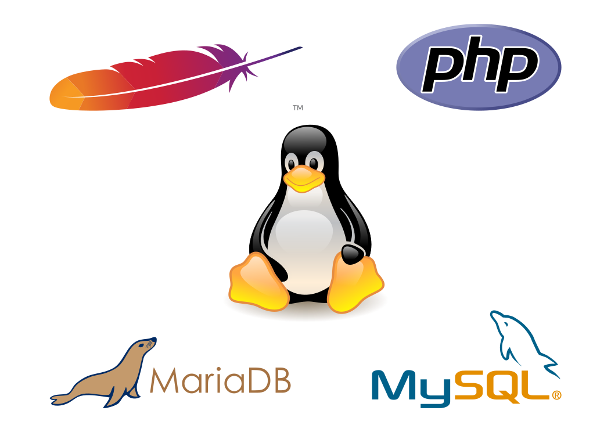
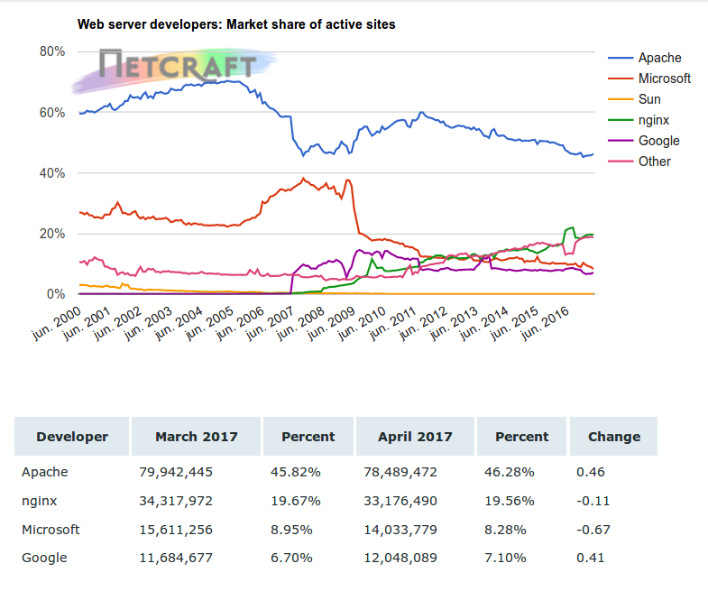

Se denomina **LAMP** a un grupo de software de código libre que se instala normalmente en conjunto para habilitar un servidor para alojar sitios y aplicaciones web dinámicas. Este término en realidad es un acrónimo que representa un sistema operativo **GNU/Linux** con un servidor web **[Apache](https://httpd.apache.org/)**, donde los datos del sitio son almacenados en base de datos **[MySQL](https://www.mysql.com/)** o **[MariaDB](https://mariadb.org/)** y el contenido dinámico es procesado con **[PHP](https://secure.php.net/)**.

!!!note "Acrónimos"
	Como de describe más arriba, **LAMP** es un acrónimo de **L**inux, **A**pache, **M**ySQL y **P**HP. Si esta pila o _stack_ de aplicaciones se ejecuta en Microsoft Windows se denomina **WAMP** y **MAMP** si se corre sobre MAC OS X.

## Apache
El servidor HTTP Apache es un servidor web HTTP de código abierto, para plataformas Unix (BSD, GNU/Linux, etc.), Microsoft Windows, Macintosh y otras. 

El servidor Apache es desarrollado y mantenido por una comunidad de usuarios bajo la supervisión de la [Apache Software Foundation](https://www.apache.org/) dentro del proyecto HTTP Server (httpd).

!!!quote ""
	Apache tiene amplia aceptación en la red: desde 1996, Apache, es el servidor HTTP más usado. 

Jugó un papel fundamental en el desarrollo fundamental de la World Wide Web y alcanzó su máxima cuota de mercado en 2005 siendo el servidor empleado en el 70% de los sitios web en el mundo, sin embargo ha sufrido un descenso en su cuota de mercado en los últimos años. En 2009 se convirtió en el primer servidor web que alojó más de 100 millones de sitios web.

_Fuente: [Wikipedia](https://es.wikipedia.org/wiki/Servidor_HTTP_Apache)  |  [Netcraft](https://news.netcraft.com/archives/2017/04/21/april-2017-web-server-survey.html)_